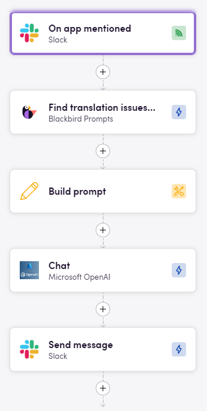

# Blackbird.io Microsoft OpenAI

Blackbird is the new automation backbone for the language technology industry. Blackbird provides enterprise-scale automation and orchestration with a simple no-code/low-code platform. Blackbird enables ambitious organizations to identify, vet and automate as many processes as possible. Not just localization workflows, but any business and IT process. This repository represents an application that is deployable on Blackbird and usable inside the workflow editor.

## Introduction

<!-- begin docs -->

Azure OpenAI Service provides access to advanced language models that you can customize for conversational AI, content creation, and data grounding.

## Before setting up

Before you can connect you need to make sure that:

- You have the `Resource URL` for your Azure OpenAI account.
- You know `Deployment name` and `API key` for your Azure OpenAI account.

You can find how to create and deploy an Azure OpenAI Service resource [here](https://learn.microsoft.com/en-us/azure/ai-services/openai/how-to/create-resource?pivots=web-portal).

## Connecting

1. Navigate to Apps, and identify the **Microsoft OpenAI** app. You can use search to find it.
2. Click _Add Connection_.
3. Name your connection for future reference e.g. 'My Microsoft OpenAI connection'.
4. Enter the `Resource URL`, `Deployment name`, and `API key` for your Azure OpenAI account.
5. Click _Connect_.
6. Verify that connection was added successfully.

## Actions

### Chat actions

- **Generate completion**: Completes the given prompt.
- **Chat**: Gives a response given a chat message.
- **Chat with system prompt**: Gives a response given a chat message and a configurable system prompt.
- **Create summary**: Summarizes the input text.
- **Generate edit**: Edit the input text given an instruction prompt.
- **Execute Blackbird prompt**: Execute prompt generated by Blackbird's AI utilities.

### Translation-Related Actions

- **Post-edit MT**: Review MT translated text and generate a post-edited version.
- **Get translation issues**: Review text translation and generate a comment with the issue description.
- **Get MQM report**: Perform an LQA Analysis of the translation. The result will be in the MQM framework form.
- **Get MQM dimension values**: Perform an LQA Analysis of the translation. This action only returns the scores (between 1 and 10) of each dimension.
- **Translate text**: Localize the text provided.

### Audio Actions

- **Create English translation**: Generates a translation into English given an audio or video file (mp3, mp4, mpeg, mpga, m4a, wav, or webm).
- **Create transcription**: Generates a transcription given an audio or video file (mp3, mp4, mpeg, mpga, m4a, wav, or webm).

### Image Actions

- **Generate image**: Generates an image based on a prompt.

### Text Analysis Actions

- **Create embedding**: Generate an embedding for a text provided. An embedding is a list of floating point numbers that captures semantic information about the text that it represents.
- **Tokenize text**: Tokenize the text provided. Optionally specify encoding: cl100k_base (used by gpt-4, gpt-3.5-turbo, text-embedding-ada-002) or p50k_base (used by codex models, text-davinci-002, text-davinci-003).

## Example

Here is an example of how you can use the `Microsoft OpenAI` app in a workflow:

This workflow automates the process of handling a specific trigger in Slack. Here's a step-by-step breakdown:

1. On app mentioned (Slack): The workflow starts when the app is mentioned in a Slack channel.
2. Find translation issues (Blackbird Prompts): It then uses Blackbird Prompts to find translation issues in the mentioned content.
3. Build prompt: Next, it constructs a prompt based on the identified issues.
4. Chat (Microsoft OpenAI): The constructed prompt is sent to Microsoft OpenAI to generate a response or solution.
5. Send message (Slack): Finally, the response from OpenAI is sent back as a message in the Slack channel.

## Feedback

Do you want to use this app or do you have feedback on our implementation? Reach out to us using the [established channels](https://www.blackbird.io/) or create an issue.

<!-- end docs -->
